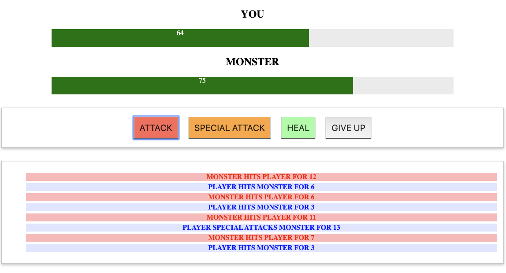

# vue-monsterslayer

A simple math-based game made with VueJS

This project is part of the [VueJS 2 - The complete guide](https://www.udemy.com/course/vuejs-2-the-complete-guide/) course by Maximillian Schwarzmüller

## How to run it?

Simply download the project to your machine and run index.html with your favorite webbrowser. 
Java-Script needs to be enabled.
